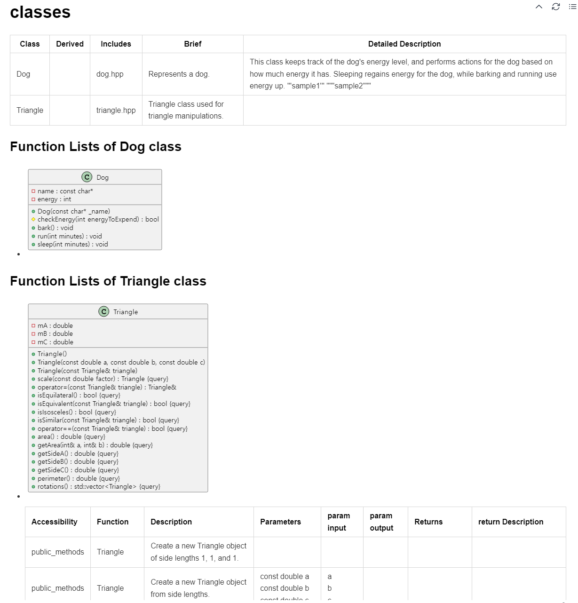
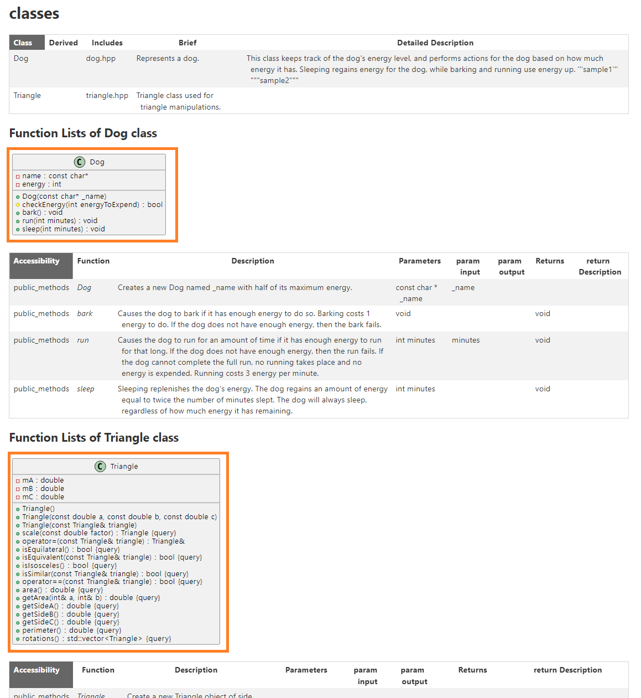
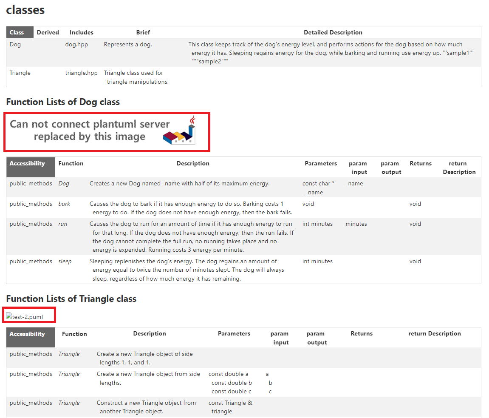

# processMap
- 

# doxygen_perlmod_python
- developers want to use parsed data from doxygen.
  - it supports DoxyDocs.py for python. it is similar to DoxyDocs.pm for perl
- they want to do something with python.

## Doxyfile
- set **GENERATE_PERLMOD = YES**

## markdown output with plantuml
- `make test1`
- source : test-1
- Doxyfile
  - GENERATE_PERLMOD = YES
  - INPUT =  ../doxygen-test-src
  - PLANTUML_JAR_PATH = ./plantuml.jar
    - but we do not copy proper plantuml.jar. we use 'touch plantuml.jar' to remove java running time.
- output
	- test-1/output/perlmod/output.md : show markdown including plantuml with vscode (useful extension : markdown preview enhanced)
    - 
- if you find some Error when you run doxygen , it is no problem.
  - show [link](test-1/README.md) to know the reason

## html output using plantuml server
- above all you set plantuml server in your accessing server with docker
    - $ ```docker run -d -p 18080:8080 plantuml/plantuml-server:tomcat```
        - you can change into your port # instead of 18080. we will use like http://[yourhostname]:18080/.
    - you need to install and run docker image. then you should set your hostname and port # in src/mysetting.py
- `make testserver`
- source : test-server
- Doxyfile
  - GENERATE_PERLMOD = YES
  - INPUT =  ../doxygen-test-src
  - PLANTUML_JAR_PATH = ./plantuml.jar
    - but we do not copy proper plantuml.jar. we use 'touch plantuml.jar' to remove java running time.
- output
    - plantuml server is working.
        - 
    - plantuml server is not working well.
        - 
- if you find some Error when you run doxygen , it is no problem.
  - show [link](test-server/README.md) to know the reason
- make alternative url in html : we can use png file when we have some error to connect to plantuml server
  - ```
    
    ```

## html with mako (python module)
- pip3 install mako
  - https://www.makotemplates.org/
- `make testmako`
- source : test-mako
- Doxyfile
  - GENERATE_PERLMOD = YES
  - INPUT =  ../doxygen-test-src
  - PLANTUML_JAR_PATH = ./plantuml.jar
    - but we do not copy proper plantuml.jar. we use 'touch plantuml.jar' to remove java running time.
- if you find some Error when you run doxygen , it is no problem.
  - show [link](test-mako/README.md) to know the reason
- output : mako result is same as `make testserver`
    - plantuml server is working.
        - 
    - plantuml server is not working well.
        - 

# taf
- [taf README](https://github.com/cheoljoo/doxygen_perlmod_python/blob/main/taf/README.md)
