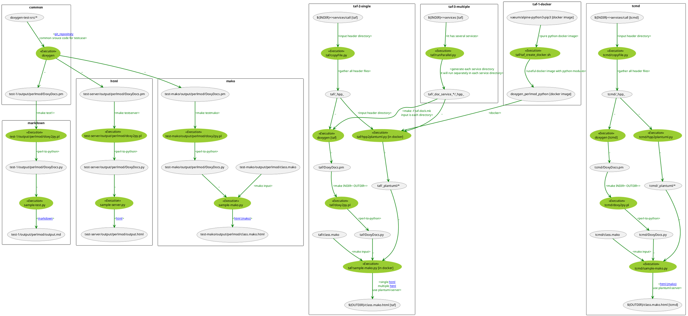

```plantuml
@startuml total.png

skinparam usecase {
    BackgroundColor<< Execution >> YellowGreen
    BorderColor<< Execution >> YellowGreen

    BackgroundColor<< Email >> LightSeaGreen
    BorderColor<< Email >> LightSeaGreen

    ArrowColor Olive
}
          rectangle common {
    usecase (doxygen) as (doxygen) << Execution >>
    (doxygen-test-src/*) --> (doxygen) #line:green;line.bold;text:green : <[[https://github.com/cheoljoo/doxygen_perlmod_python git_repository]]\ncommon srouce code for testcase>
    (doxygen) --> (test-1/output/perlmod/DoxyDocs.pm) #line:green;line.bold;text:green : _
  }
  rectangle html {
    usecase (doxygen) as (doxygen) << Execution >>
    usecase (sample-server.py) as (sample-server.py) << Execution >>
    usecase (test-server/output/perlmod/doxy2py.pl) as (test-server/output/perlmod/doxy2py.pl) << Execution >>
    (doxygen) --> (test-server/output/perlmod/DoxyDocs.pm) #line:green;line.bold;text:green : _
    (test-server/output/perlmod/DoxyDocs.pm) --> (test-server/output/perlmod/doxy2py.pl) #line:green;line.bold;text:green : <make testserver>
    (test-server/output/perlmod/doxy2py.pl) --> (test-server/output/perlmod/DoxyDocs.py) #line:green;line.bold;text:green : <perl-to-python>
    (test-server/output/perlmod/DoxyDocs.py) --> (sample-server.py) #line:green;line.bold;text:green : _
    (sample-server.py) --> (test-server/output/perlmod/output.html) #line:green;line.bold;text:green : <[[http://tiger02.lge.com/cheoljoo.lee/code/doxygen_perlmod_python/test-server/output/perlmod/output.html html]]>
  }
  rectangle mako {
    usecase (doxygen) as (doxygen) << Execution >>
    usecase (sample-mako.py) as (sample-mako.py) << Execution >>
    usecase (test-mako/output/perlmod/doxy2py.pl) as (test-mako/output/perlmod/doxy2py.pl) << Execution >>
    (test-mako/output/perlmod/class.mako) --> (sample-mako.py) #line:green;line.bold;text:green : <mako input>
    (doxygen) --> (test-mako/output/perlmod/DoxyDocs.pm) #line:green;line.bold;text:green : _
    (test-mako/output/perlmod/DoxyDocs.pm) --> (test-mako/output/perlmod/doxy2py.pl) #line:green;line.bold;text:green : <make testmako>
    (test-mako/output/perlmod/doxy2py.pl) --> (test-mako/output/perlmod/DoxyDocs.py) #line:green;line.bold;text:green : <perl-to-python>
    (test-mako/output/perlmod/DoxyDocs.py) --> (sample-mako.py) #line:green;line.bold;text:green : _
    (sample-mako.py) --> (test-mako/output/perlmod/class.mako.html) #line:green;line.bold;text:green : <[[http://tiger02.lge.com/cheoljoo.lee/code/doxygen_perlmod_python/test-mako/output/perlmod/class.mako.html html (mako)]]>
  }
  rectangle markdown {
    usecase (sample-test.py) as (sample-test.py) << Execution >>
    usecase (test-1/output/perlmod/doxy2py.pl) as (test-1/output/perlmod/doxy2py.pl) << Execution >>
    (test-1/output/perlmod/DoxyDocs.pm) --> (test-1/output/perlmod/doxy2py.pl) #line:green;line.bold;text:green : <make test1>
    (test-1/output/perlmod/doxy2py.pl) --> (test-1/output/perlmod/DoxyDocs.py) #line:green;line.bold;text:green : <perl-to-python>
    (test-1/output/perlmod/DoxyDocs.py) --> (sample-test.py) #line:green;line.bold;text:green : _
    (sample-test.py) --> (test-1/output/perlmod/output.md) #line:green;line.bold;text:green : <[[http://tiger02.lge.com/cheoljoo.lee/code/doxygen_perlmod_python/test-1/output/perlmod/output.md markdown]]>
  }
  rectangle taf-1-docker {
    usecase (taf/taf_create_docker.sh) as (taf/taf_create_docker.sh) << Execution >>
    (vaeum/alpine-python3-pip3 [docker image]) --> (taf/taf_create_docker.sh) #line:green;line.bold;text:green : <pure python docker image>
    (taf/taf_create_docker.sh) --> (doxygen_perlmod_python [docker image]) #line:green;line.bold;text:green : <useful docker image with python modules>
  }
  rectangle taf-2-single {
    usecase (doxygen [taf]) as (doxygen [taf]) << Execution >>
    usecase (taf/copyFile.py) as (taf/copyFile.py) << Execution >>
    usecase (taf/doxy2py.pl) as (taf/doxy2py.pl) << Execution >>
    usecase (taf/hpp2plantuml.py [in docker]) as (taf/hpp2plantuml.py [in docker]) << Execution >>
    usecase (taf/sample-mako.py [in docker]) as (taf/sample-mako.py [in docker]) << Execution >>
    (${INDIR}=>services/call [taf]) --> (taf/copyFile.py) #line:green;line.bold;text:green : <input header directory>
    (taf/copyFile.py) --> (taf/_hpp_) #line:green;line.bold;text:green : <gather all header files>
    (taf/_hpp_) --> (doxygen [taf]) #line:green;line.bold;text:green : _
    (doxygen [taf]) --> (taf/DoxyDocs.pm) #line:green;line.bold;text:green : _
    (taf/DoxyDocs.pm) --> (taf/doxy2py.pl) #line:green;line.bold;text:green : <make INDIR= OUTDIR=>
    (taf/doxy2py.pl) --> (taf/DoxyDocs.py) #line:green;line.bold;text:green : <perl-to-python>
    (doxygen_perlmod_python [docker image]) --> (taf/hpp2plantuml.py [in docker]) #line:green;line.bold;text:green : <docker>
    (taf/_hpp_) --> (taf/hpp2plantuml.py [in docker]) #line:green;line.bold;text:green : <input header directory>
    (taf/hpp2plantuml.py [in docker]) --> (taf/_plantuml/*) #line:green;line.bold;text:green : _
    (taf/_plantuml/*) --> (taf/sample-mako.py [in docker]) #line:green;line.bold;text:green : _
    (taf/DoxyDocs.py) --> (taf/sample-mako.py [in docker]) #line:green;line.bold;text:green : _
    (taf/sample-mako.py [in docker]) --> (${OUTDIR}/class.mako.html [taf]) #line:green;line.bold;text:green : <single [[http://tiger02.lge.com/cheoljoo.lee/code/doxygen_perlmod_python/taf/module/call/class.mako.html html]]\nmultiple [[http://tiger02.lge.com/cheoljoo.lee/code/doxygen_perlmod_python/taf/module/ html]]\nuse plantuml-server>
    (taf/class.mako) --> (taf/sample-mako.py [in docker]) #line:green;line.bold;text:green : <mako input>
  }
  rectangle taf-3-multiple {
    usecase (doxygen [taf]) as (doxygen [taf]) << Execution >>
    usecase (taf/hpp2plantuml.py [in docker]) as (taf/hpp2plantuml.py [in docker]) << Execution >>
    usecase (taf/runParallel.py) as (taf/runParallel.py) << Execution >>
    (${INDIR}=>services [taf]) --> (taf/runParallel.py) #line:green;line.bold;text:green : <it has several services>
    (taf/runParallel.py) --> (taf/_doc_service_*/_hpp_) #line:green;line.bold;text:green : <generate each service directory\nit will run separately in each service directory>
    (taf/_doc_service_*/_hpp_) --> (doxygen [taf]) #line:green;line.bold;text:green : <make -f taf-dock.mk \ninput is each directory>
    (taf/_doc_service_*/_hpp_) --> (taf/hpp2plantuml.py [in docker]) #line:green;line.bold;text:green : _
  }
  rectangle tcmd {
    usecase (doxygen [tcmd]) as (doxygen [tcmd]) << Execution >>
    usecase (tcmd/copyFile.py) as (tcmd/copyFile.py) << Execution >>
    usecase (tcmd/doxy2py.pl) as (tcmd/doxy2py.pl) << Execution >>
    usecase (tcmd/hpp2plantuml.py) as (tcmd/hpp2plantuml.py) << Execution >>
    usecase (tcmd/sample-mako.py) as (tcmd/sample-mako.py) << Execution >>
    (${INDIR}=>services/call [tcmd]) --> (tcmd/copyFile.py) #line:green;line.bold;text:green : <input header directory>
    (tcmd/copyFile.py) --> (tcmd/_hpp_) #line:green;line.bold;text:green : <gather all header files>
    (tcmd/_hpp_) --> (doxygen [tcmd]) #line:green;line.bold;text:green : _
    (doxygen [tcmd]) --> (tcmd/DoxyDocs.pm) #line:green;line.bold;text:green : _
    (tcmd/DoxyDocs.pm) --> (tcmd/doxy2py.pl) #line:green;line.bold;text:green : <make INDIR= OUTDIR=>
    (tcmd/doxy2py.pl) --> (tcmd/DoxyDocs.py) #line:green;line.bold;text:green : <perl-to-python>
    (tcmd/_hpp_) --> (tcmd/hpp2plantuml.py) #line:green;line.bold;text:green : _
    (tcmd/hpp2plantuml.py) --> (tcmd/_plantuml/*) #line:green;line.bold;text:green : _
    (tcmd/_plantuml/*) --> (tcmd/sample-mako.py) #line:green;line.bold;text:green : _
    (tcmd/DoxyDocs.py) --> (tcmd/sample-mako.py) #line:green;line.bold;text:green : _
    (tcmd/sample-mako.py) --> (${OUTDIR}/class.mako.html [tcmd]) #line:green;line.bold;text:green : <[[http://tiger02.lge.com/cheoljoo.lee/code/doxygen_perlmod_python/tcmd/module/regionService/class.mako.html html (mako)]]\nuse plantuml-server>
    (tcmd/class.mako) --> (tcmd/sample-mako.py) #line:green;line.bold;text:green : <mako input>
  }
@enduml
```
